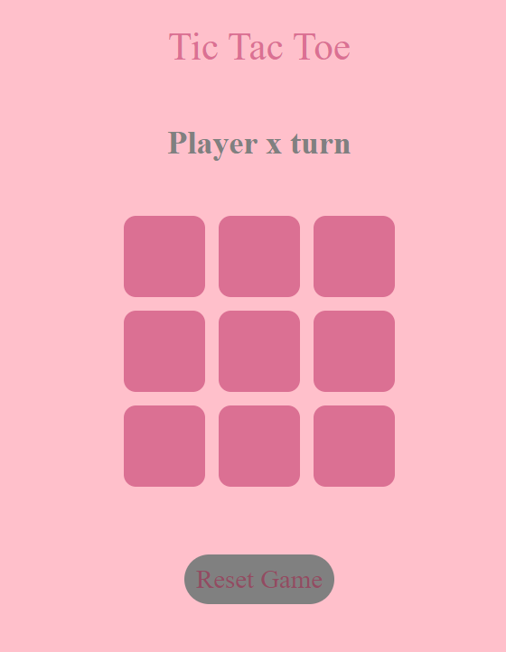
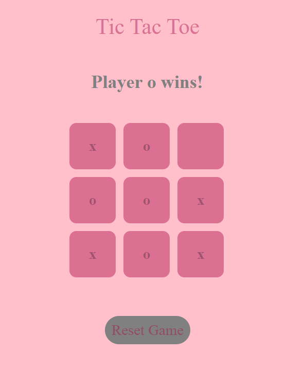
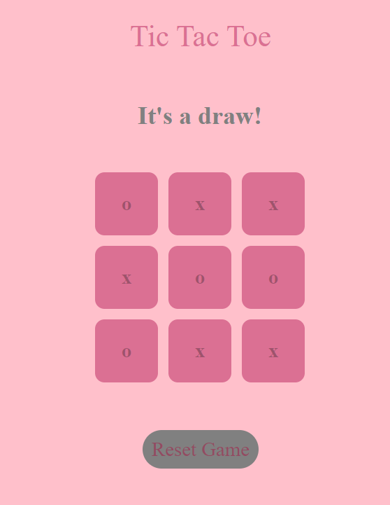

# Tic-tac toe

[tic-tac-toe website](https://kimrv000.github.io/tic-tac-toe/)

## Specifications

Tic-tac-toe was devoloped in: 

- React

Using:

- HTML
- CSS
- JavaScript

Tic-tac-toe it's a two players game. 

1. Players take turns putting their marks in empty squares. 

2. The first player to get 3 of her marks in a row (up, down, across, or diagonally) is the winner.

3. When all 9 squares are full, the game is over. If no player has 3 marks in a row, the game ends in a draw.

